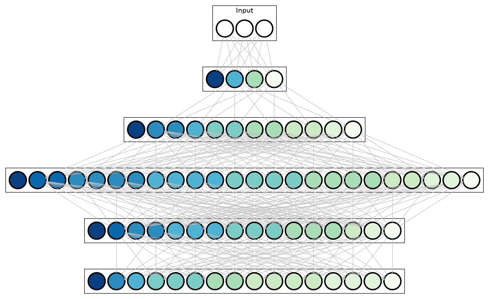

# NN_visualize
Visualizing Neural Networks with graphviz

## Introduction

Represent NN as a graph where nodes indicate neurons. It is important that we treate each convolutional channel as one neuron, so the neural network can be visualized in a fully connected way, which is significantlt straightforward.

Here we take the convolutional backend of AlexNet as an example:



Problem is, number of channels in CNN is enormous, so we grouped neurons with fixed group cardinality (16 for AlexNet, see `vis_alexnet.py` for details). Color of neurons here denotes various neuron activity, given a single input image.

## Quick Start

- 1. Make sure graphviz is installed. For Linux users:

    ```
        suto-apt install graphiviz & pip3 install graphviz
    ```

- 2. Generate `.dot` graph configuration files

    ```
    python vis_alexnet.py
    ```

- 3. Generate output image

    ```
    dot -Tpdf -o ./img/alexnet_1.pdf ./configs/alexnet_1.dot
    ```

- 4. We provide extra scripts for plotting neuronal activity curves in `plot_curve.py`


## Note

- The neural network activity record in `records` are recorded for one given image, specifically we add one global average pooling layer after each convolutional layer of AlexNet, and stored this aggregated features for each layer. Users could write scripts based on `vis_alexnet.py` for other network architecture.